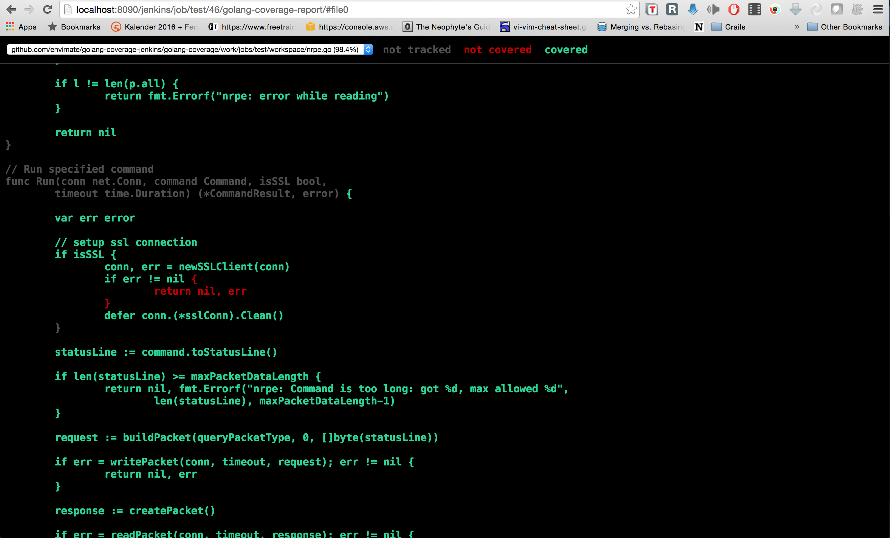
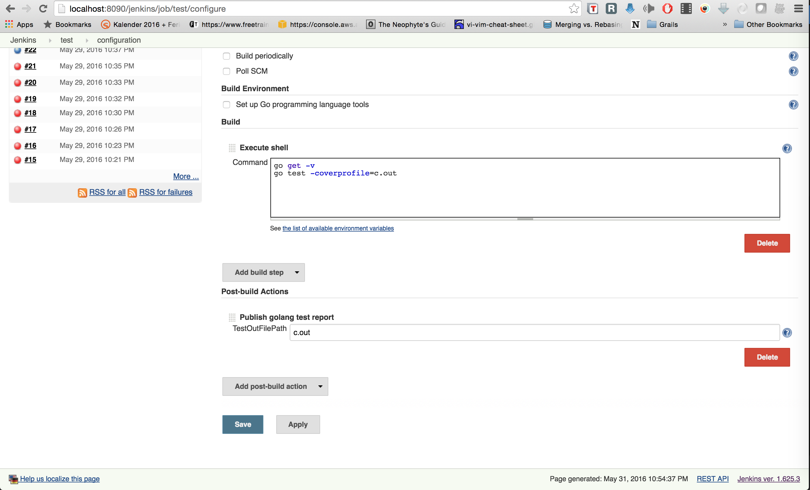

# Test coverage report for golang

Jenkins plugin for showing go test coverage html generated by running `go tool cover`

Although a common approach is converting the output `go test` into cobertura coverage report, I find it useful to have simpler alternative showing the build-in golang generated HTML report.

## Supported versions

Tested with Jenkins 1.625.3

## TODO

Add support to merge multi-package report
